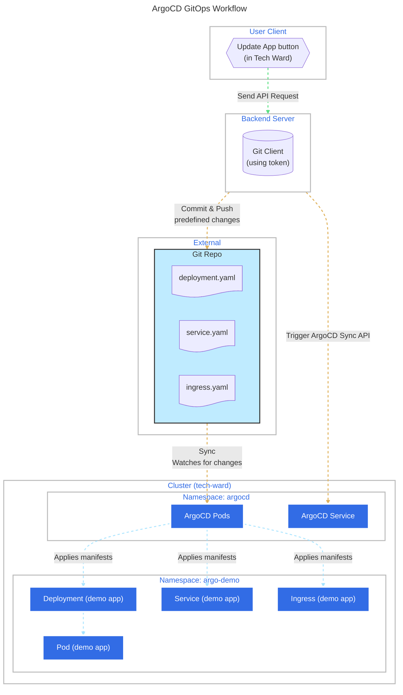

# How to set it up

- Create a dedicated GitHub repo

- Add the Kubernetes manifests
  - Deployment, Service, ConfigMap, etc.

- Generate a GitHub token
  - Use separate github account (not main) to avoid security issues.
  - Go to Settings → Developer settings → Personal access tokens.
    - https://github.com/settings/tokens
  - Generate token.
  - Grant repo:public_repo (for public) or repo (for private) access.
  - Store it securely (e.g., in environment variable in backend).

## Backend setup

Use the token for authentication when committing and pushing changes automatically.

## Architecture Diagram

