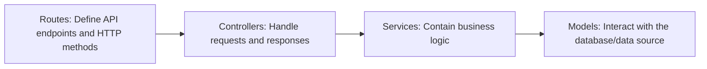

# Backend Architecture

This document outlines the architecture of the Tech Ward backend application.
The backend follows a standard layered architecture pattern, separating concerns
into four distinct layers: `Routes`, `Controllers`, `Services`, and `Models`.

This structure makes the application more organized, scalable, and easier to
maintain.

---

### 1. Routes (`routes/`)

- **Purpose:** The router layer is the entry point for all API requests. Its
  sole responsibility is to define the API endpoints (URLs) and the HTTP methods
  they respond to (e.g., `GET`, `POST`, `PATCH`).
- **How it works:** Each route maps a specific URL and HTTP method to a single
  controller function. It doesn't know anything about business logic; it only
  knows which controller to call.
- **Example:** The file `routes/patientRoutes.ts` defines that a `GET` request
  to `/patients` should be handled by the `getPatients` function in the
  `patient.controller.ts` file.

### 2. Controllers (`controllers/`)

- **Purpose:** The controller layer acts as the intermediary between the router
  and the service layer. It handles the incoming request and the outgoing
  response.
- **How it works:**
  - It receives the request from the router.
  - It extracts relevant information from the request, such as URL parameters
    (`req.params`), query parameters (`req.query`), and the request body
    (`req.body`).
  - It calls the appropriate service layer function to execute the business
    logic, passing the extracted data.
  - It receives the result from the service and formats it into an HTTP
    response, setting the status code (e.g., `200 OK`, `404 Not Found`) and
    sending the JSON payload back to the client.
- **Example:** The `patient.controller.ts` file has a `getPatients` function
  that calls the `getPatients` service, then sends the result as a JSON
  response.

### 3. Services (`services/`)

- **Purpose:** The service layer contains the core business logic of your
  application. This is where you define _what_ your application does.
- **How it works:**
  - It is called by the controller.
  - It orchestrates the business logic, which may involve calling multiple model
    functions, interacting with external services (like the `updateDeployment`
    service does), or performing complex calculations.
  - It is completely independent of the HTTP layer; it doesn't know about
    requests or responses. This makes the business logic reusable and easier to
    test in isolation.
- **Example:** The `patient.service.ts` file contains the logic for resolving a
  problem, which includes checking the problem type and potentially calling the
  `updateDeployment` service.

### 4. Models (`models/`)

- **Purpose:** The model layer is responsible for all communication with the
  database (or any other data source). Its job is to perform CRUD (Create, Read,
  Update, Delete) operations.
- **How it works:**
  - It is called by the service layer.
  - It contains the functions to directly interact with your data. In your case,
    it manages the in-memory `patients` array. In a larger application, this is
    where you would write your database queries (e.g., using an ORM like Prisma
    or TypeORM).
  - It handles the raw data and returns it to the service layer.
- **Example:** The `patients.ts` model provides functions like `getPatients` and
  `getPatient` that retrieve data from the `patients` array.

---

### The Flow of a Request

Here is the typical flow of a request through this architecture:

1.  A `GET /patients` request hits the **Router**.
2.  The router sees that this request should be handled by the `getPatients`
    function in the **Controller**.
3.  The `getPatients` controller function calls the `getPatients` function in
    the **Service**.
4.  The `getPatients` service function calls the `getPatients` function in the
    **Model**.
5.  The model retrieves the patient data and returns it to the service.
6.  The service processes the data (e.g., calculates the health status) and
    returns it to the controller.
7.  The controller formats the data into a JSON response and sends it back to
    the client.
